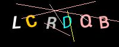
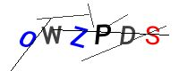
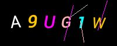
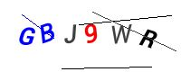

# Module bluetape4k-captcha

Captcha 이미지를 생성하는 라이브러리입니다.

## 사용법

### 환경 설정

`CaptchaConfig` 클래스를 이용하여 Captcha 이미지를 생성할 때 사용할 설정을 지정합니다.

```kotlin
import java.awt.Color

private val config = CaptchaConfig(
    width = 200,
    height = 80,
    length = 6,                     // captcha code 길이 
    noiseCount = 5,
    theme = CaptchaTheme.DARK,
    darkBackgroundColor = Color.BLACK,
    lightBackgroundColor = Color.WHITE
)
```

### ImageCaptchar 생성

```kotlin
config.noiseCount = 6
val codeGen = CaptchaCodeGenerator(symbols = CaptchaCodeGenerator.UPPER)
val captchaGen = ImageCaptchaGenerator(config, codeGen)

val captcha = captchaGen.generate()  // Captcha 생성
val jpgBytes = captcha.toBytes()     // JPG 바이트로 변환
```

### Captcha 정보

```kotlin
/**
 * 이미지 형태의 Captcha
 *
 * @property image captcha 이미지
 * @property code  captcha 코드
 */
data class ImageCaptcha(
    override val code: String,
    override val content: ImmutableImage,
): Captcha<ImmutableImage>
```

`ImageCaptcha` 객체를 JPG 등으로 변환하고, 파일로 저장할 수 있는 Extension method 를 활용하면 됩니다.

```kotlin
internal val DEFAULT_IMAGE_WRITER = JpegWriter()

/**
 * [ImageCaptcha]의 이미지를 원하는 포맷의 ByteArray 로 변환합니다.
 *
 * @param writer [ImageWriter] 인스턴스 (기본값: JpegWriter)
 * @return
 */
fun ImageCaptcha.toBytes(writer: ImageWriter = DEFAULT_IMAGE_WRITER): ByteArray {
    return content.bytes(writer)
}

/**
 * [ImageCaptcha]의 이미지를 지정한 [path]에 원하는 포맷의 이미지 파일로 저장합니다.
 *
 * @param path 이미지를 저장할 경로
 * @param writer [ImageWriter] 인스턴스 (기본값: JpegWriter)
 * @return
 */
fun ImageCaptcha.writeToFile(path: Path, writer: ImageWriter = DEFAULT_IMAGE_WRITER): Path {
    return content.forWriter(writer).write(path)
}
```

## 생성된 이미지

1. 대문자만으로 생성한 Captcha 이미지




2. 대문자만와 숫자로 생성한 Captcha 이미지



